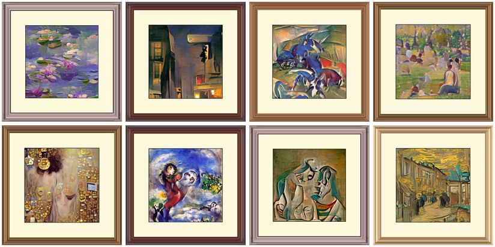
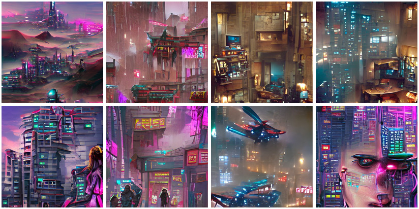
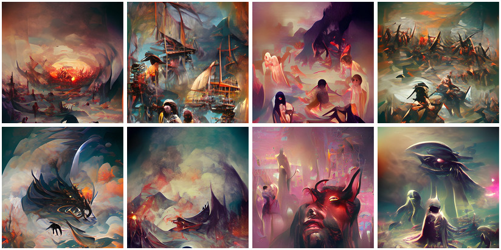

# Pictures Of The Floating World

An art collaboration between human and AI.

Enjoy the artworks from these galleries:

## Inspirations

Artwork inspired by the great artists and painters throughout human history

* [View Gallery](https://apigeek.net/art/inspired)

## Ukiyo-e 浮世

Pieces in the style of 19th century Japanese art

* [View Gallery](https://apigeek.net/art/ukiyoe)

## The Disturbing Universe

A hommage to the great H.R. Giger and the beautifully strange artwork he created

[* View Gallery](https://apigeek.net/art/giger)

## The New World

Fantastic pieces, steam punk style

* [View Gallery](https://apigeek.net/art/thenewworld)

## Cyber Soul

Scenes that could as well be concept art pieces for the Blade Runner movie and video games.

* [View Gallery](https://apigeek.net/art/cybersoul)

## Dark Visions

Surreal creatures and imagination

* [View Gallery](https://apigeek.net/art/darkvisions)

### This looks awesome! How was this created?

Short answer: a combination of AI, APIs, automation, and a good portion of human creativity

Long answer: Art often comes with a good level of ambiguity and obscurity. Get in touch if you want to learn more!

**Everything you see here was created for educational purpuses.** 