# H.R. Giger – The Disturbing Universe

| | |
| --- | --- |
| [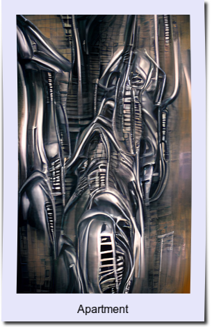](apartment.jpg) | [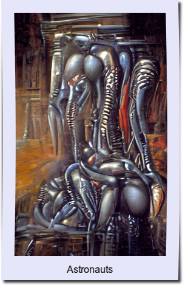](astronauts.jpg) |
| [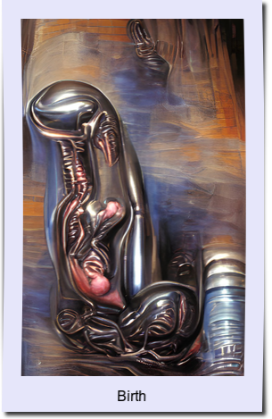](birth.jpg) | [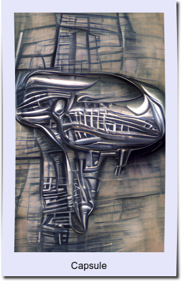](capsule.jpg) |
| [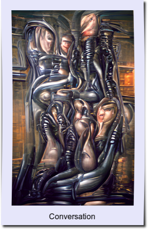](conversation.jpg) | [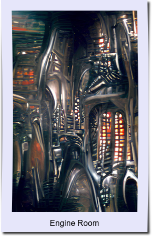](engine-room.jpg) |
| [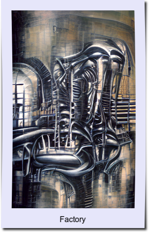](factory.jpg) | [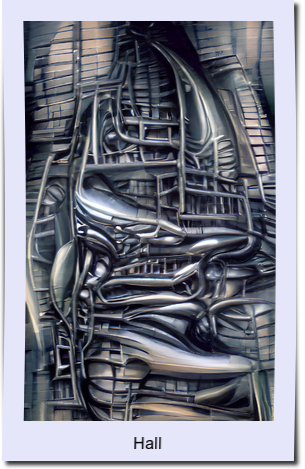](hall.jpg) |
| [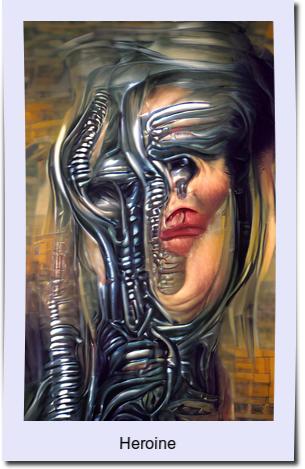](heroine.jpg) | [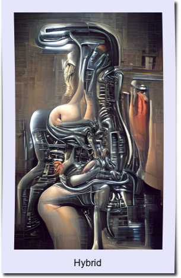](hybrid.jpg) |
| [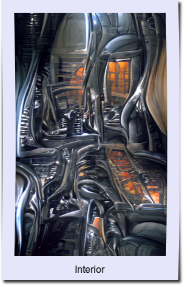](interior.jpg) | [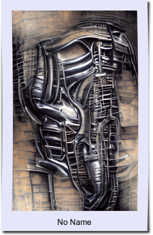](no-name.jpg) |
|  |  |
|  | [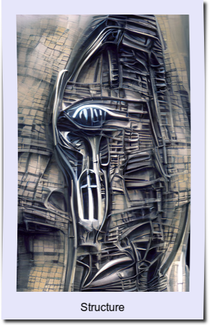](structure.jpg) |
| [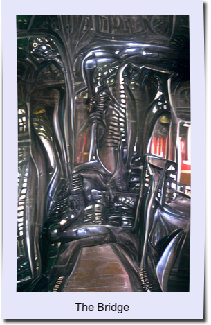](the-bridge.jpg) |  |
| [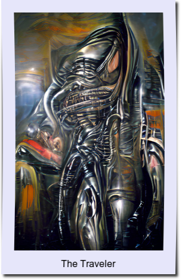](the-traveler.jpg) |  |
| [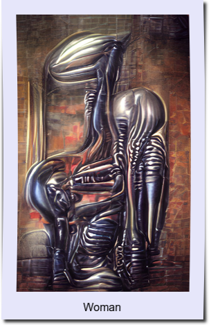](woman.jpg) | [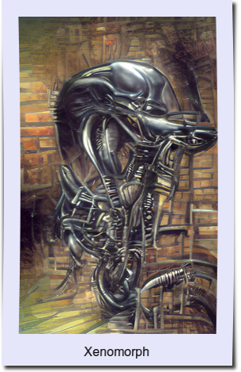](xenomorph.jpg) |
