# H.R. Giger – The Disturbing Universe

| | |
| --- | --- |
| [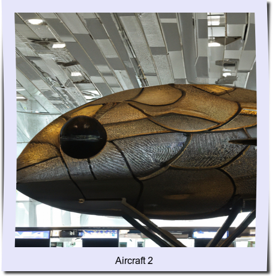](aircraft-2.jpg) | [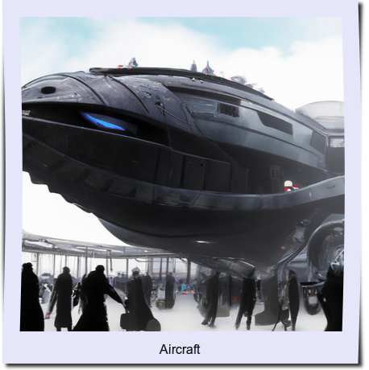](aircraft.jpg) |
| [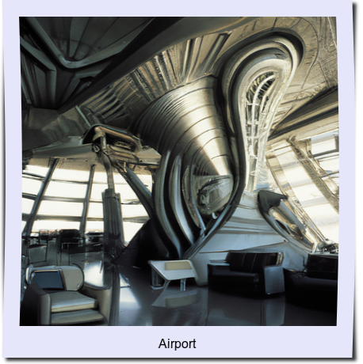](airport.jpg) | [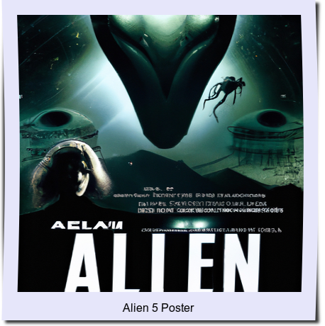](alien-5-poster.jpg) |
| [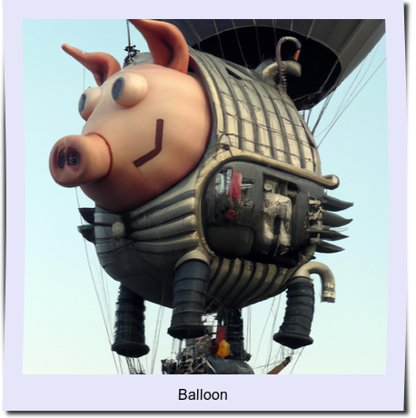](balloon.jpg) | [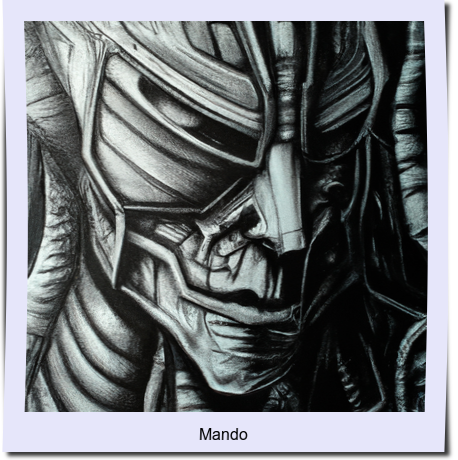](mando.jpg) |
|  |  |
| [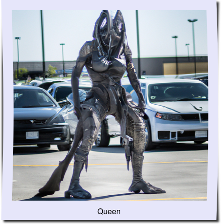](queen.jpg) | [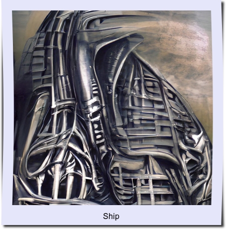](ship.jpg) |
| [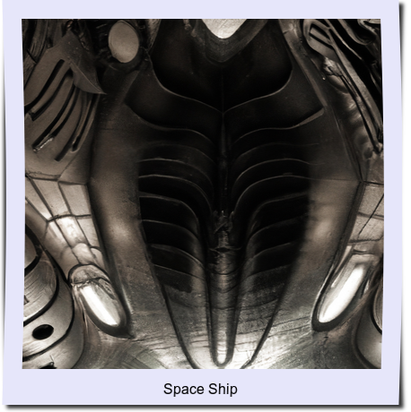](space-ship.jpg) | [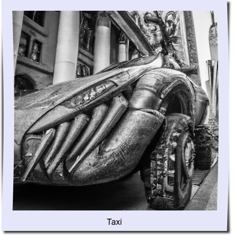](taxi.jpg) |
| [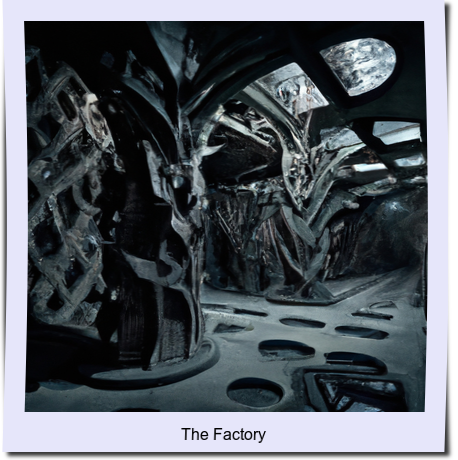](the-factory.jpg) | [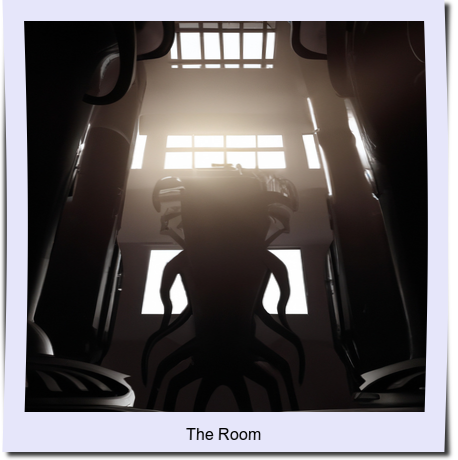](the-room.jpg) |
| [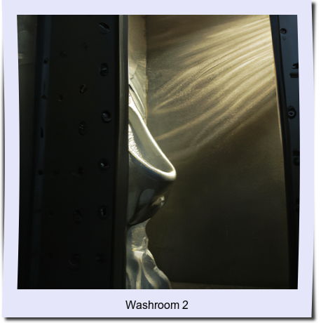](washroom-2.jpg) |  |
| [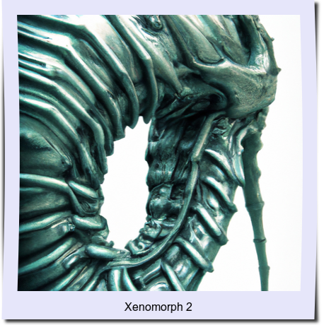](xenomorph-2.jpg) | [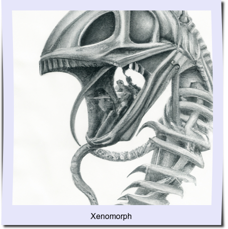](xenomorph.jpg) |
