# Inspired Art

| | |
| --- | --- |
|  |  |
| Antoni Gaudi: The Cathedral | Caspar David Friedrich: Seaside |
|  |  |
| Caspar David Friedrich: Valley | Cezanne |
| [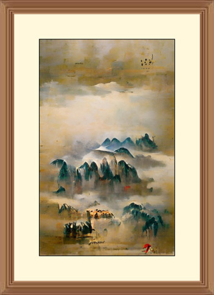](chinese-art.jpg) | [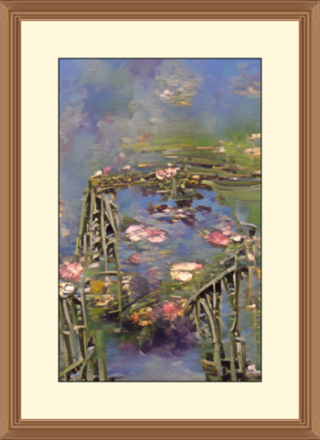](claude-monet_my-garden.jpg) |
| Chinese Art | Claude Monet: My Garden |
|  |  |
| Claude Monet: Sailing | Claude Monet: The Lake |
|  |  |
| Claude Monet: The Market | Claude Monet: Water Lilies |
|  | [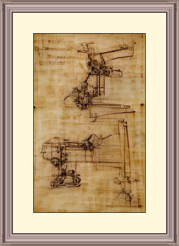](da-vinci_machines.jpg) |
| Da Vinci: Anatomy | Da Vinci: Machines |
| [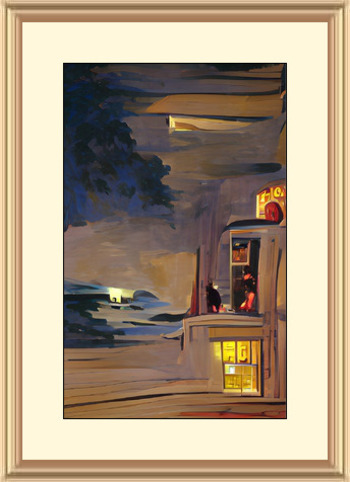](edward-hopper_-the-storm.jpg) | [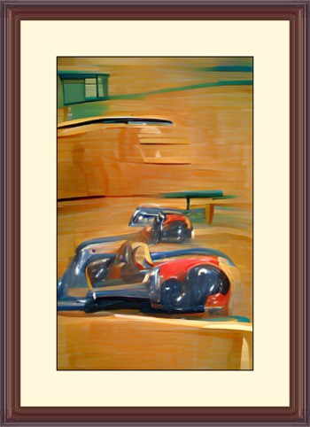](edward-hopper_car-race.jpg) |
| Edward Hopper: The Storm | Edward Hopper: Car Race |
|  |  |
| Edward Hopper: Nightshift | Egyptian Tomb |
|  | [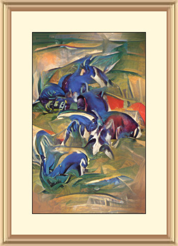](franz-marc_horses.jpg) |
| Escher | Franz Marc: Horses |
| [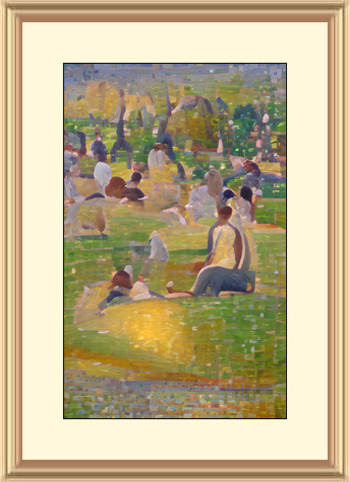](georges-seurat_at-the-park.jpg) |  |
| Georges Seurat: At The Park | Georges Seurat: Village Market |
|  | [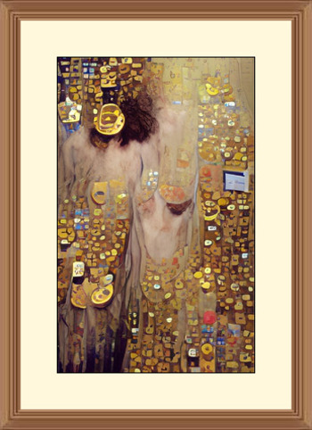](gustav-klimt.jpg) |
| Giger: Xenomorph | Gustav Klimt |
|  |  |
| Henri Matisse: Farm | Henri Matisse: Red Hotel |
|  | [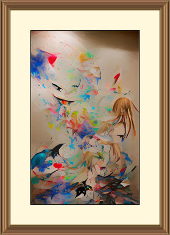](joan-miro_colors.jpg) |
| Hieronymus Bosch: Eden | Joan Miro: Colors |
|  |  |
| Joan Miro: Miracle | Kandinsky: Art Workshop |
|  | [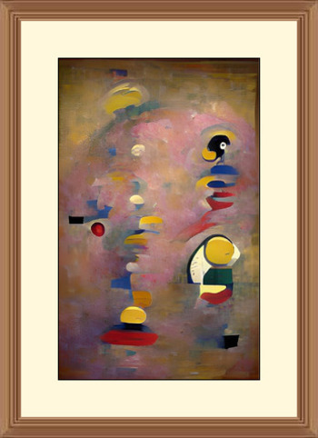](kandinsky_birds.jpg) |
| Kandinsky: Bicycle | Kandinsky: Birds |
|  |  |
| Marc Chagall: Church | Marc Chagall: Field |
|  |  |
| Michelangelo | Pablo Picasso: Dancers |
|  | [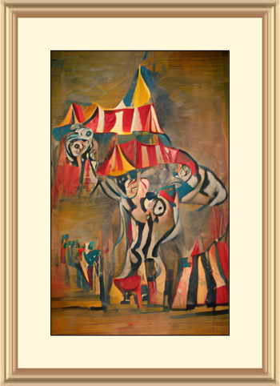](pablo-picasso_the-carousel.jpg) |
| Pablo Picasso: Faces | Pablo Picasso: The Carousel |
|  |  |
| Pablo Picasso: The Circus | Pablo Picasso: Untitled |
|  |  |
| Paul Gauguin: The Two Sisters | Pierre Auguste Renoir: The Picnic |
|  |  |
| Raphael: School Of Athens | Rembrandt: Fruits |
|  |  |
| Rene Magritte: Mountain | Rene Magritte: No Apple |
| [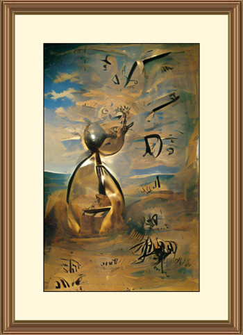](salvador-dali_landscape.jpg) |  |
| Salvador Dali: Landscape | Salvador Dali: The Sea |
| [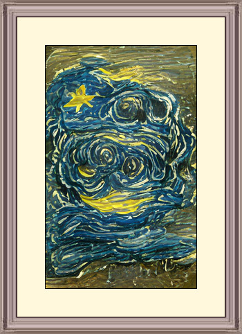](van-gogh_another-starry-night.jpg) |  |
| Van Gogh: Another Starry Night | Van Gogh: Street Life |
