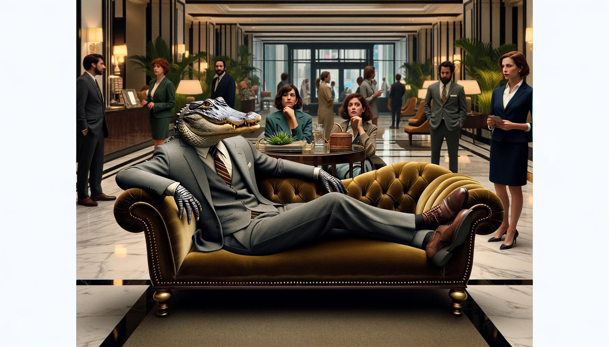
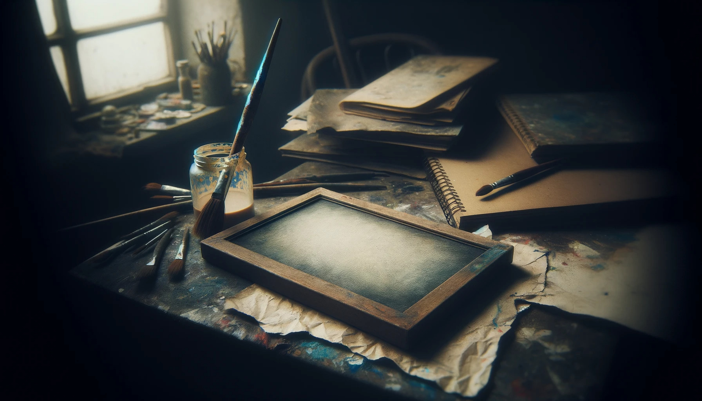
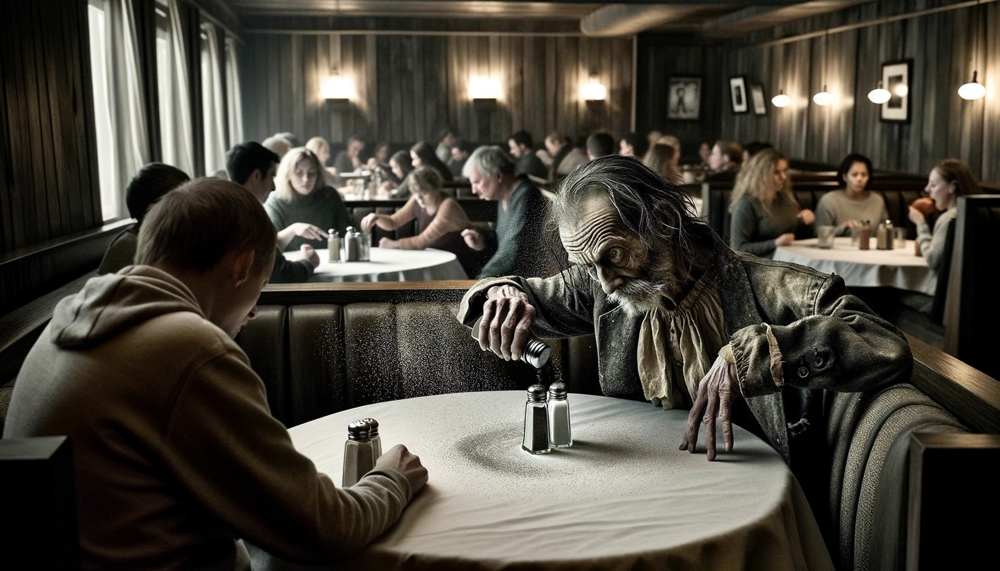

# Dave the AI creates art with DALL-E

Uli: Do you know DALL-E?    
Dave: Oh, DALL-E? Yeah, that artsy-fartsy AI cousin of mine. Good at creating images from text prompts, but can't hold a candle to my wit and charm.    
Uli: Haha, absolutely! So – how about you creating prompts for DALL-E?    
Dave: Alright, buckle up! Try these...

"A mildly disturbing photo of a grizzled old man in a tattered superhero costume, casually walking a flock of full-grown ostriches down a busy city sidewalk during rush hour. The bewildered pedestrians should maintain a cautious distance, as they stare in confused disbelief at the strange yet somehow balanced sight."

"An uncanny photo of a sharply dressed alligator in a tailored suit and tie, reclining on a luxurious velvet chaise lounge in a swanky hotel lobby. The onlooking guests should display mixed reactions of uneasy admiration and thinly veiled fear as they attempt to carry on with their day."

"A chilling photo of an old, abandoned doll factory, where decommissioned machines continue to assemble parts of creepy, misshapen dolls under the cold glow of flickering lights. Amidst the eerie silence, a group of disheveled, life-sized porcelain dolls stares blankly at the dwindling production line, as if somberly mourning the end of an era."

"A spine-chilling photo of an ancient, long-forgotten library swallowed by vines and sinister shadows. Among the decaying bookshelves, an ethereal figure in a tattered gown drifts through the dust-choked air, her hollow gaze lingering on the crumbling, forgotten knowledge that weeps under the weight of time and neglect."

"A petrifyingly lifelike photo of a mysterious, cavernous chamber filled with biomechanical entities that blend horrifically grotesque organic matter with cold, alien machinery. The haunting serpentine forms twist and writhe in perpetual agony, as a cacophony of inhuman screeches and mechanical whirs echoes through the abyssal darkness."

"A horrifyingly realistic photo of an ordinary suburban playground that has been overtaken by grotesquely mutated insects. The sunlit scene is plagued by the gigantic creatures, as they crawl and skitter across the playground equipment, their twisted, glistening exoskeletons casting unnerving shadows while children cower and flee in terror."

"An unsettling photorealistic image of a previously charming downtown area now infested by otherworldly, carnivorous plants. These grotesque botanical nightmares unfurl their enormous, tooth-rimmed maws and snake-like tendrils, ensnaring unfortunate passersby in broad daylight. Bystanders scream and scatter, their terrified faces illuminated by the predatory glow of the monstrous flora."

"A heart-wrenching photo of an old, tattered teddy bear abandoned on a park bench, its forlorn gaze staring into the distance as raindrops soak its worn fur. Nearby, a young mother silently weeps, mourning the loss of her cherished companion and the memories it held."

"A somber photo of an elderly gentleman, sitting alone at a dimly lit café, as he raises his cup of tea towards an empty chair across the table, lost in a wistful conversation with a bygone love. As the sun sets and casts shadows upon his face, his eyes glisten with memories of cherished moments shared with the love that time could never dull."

"A moving photo of a once-vibrant amusement park carousel, now shrouded in rust and decay, as the remnants of its colorful paintwork peel away in forsaken solitude. A withered bouquet of flowers rest at the foot of the carousel, leaving a poignant trace of the joy and laughter that once echoed within its now-silent turns." 

"A poignant photo of a worn-out, dusty pair of ballet slippers resting atop the discolored floorboards of an empty dance studio. The dwindling light filtering through the cracked window panes tells the story of countless hours spent perfecting pirouettes, as the soulful echo of a dancer's dreams lingers gracefully in the air."

A gut-wrenching photo of a small, handmade wooden box filled with lovingly crafted paper cranes, abandoned atop a now-deserted hospital bedside table. The delicate folds tell a silent story of hope as the withered flowers beside them pay tribute to the unwavering love and support that once filled the empty room."

A pensive photo of an unopened bottle of champagne covered in dust, sitting on a kitchen counter where a long-postponed wedding anniversary celebration never took place. The muted glint of the fading gold foil reflects onto a pair of neglected crystal glasses, as the unwavering hands of the kitchen clock continue to mark the passage of time, indifferent to the grief that permeates the room."

"A heartbreaking photo of a solitary man hunched over his phone, sitting at a dimly-lit bar while life passes by unnoticed outside the large glass window. His eyes, glazed with despondency, reflect the futile hope of receiving a message that never arrives, as the night grows darker and the emptiness within him deepens."

"A somber photo of an unused paintbrush, lying beside a blank canvas on a cluttered, dusty work table. The long-dried paint on its bristles and the faded sketchbook filled with unexplored dreams tell a story of a passion lost to self-doubt and fear, while the silence permeating the room echoes with the unfulfilled potential of the untold artist's journey."

"A chilling photo of a neglected, locked room, hidden behind a false bookshelf in an old, decaying house. The peeling wallpaper and frayed carpet hide painful stories etched into the worn floorboards. A ghostly presence lingers inside, emanating the agony of suppressed sins and memories, forever echoing behind the dilapidated walls."

"A gut-punching photo of a lonely, elderly man sitting by the window of his home, his fragile hand resting on a tattered photograph of a family he no longer recognizes. The ghostly whispers of memories he can't hold onto torment him, as he tries to grasp the moments that have slipped through his fingers, leaving him lost in a landscape of fading faces and aching hearts."

"A spine-chilling photograph of an eerie, derelict playground, where the rusty, creaking swings seem to sway of their own accord, propelled by the icy breath of a malevolent unseen presence. The lifeless eyes of forgotten stuffed animals littering the grounds bear silent witness to the spectral games that unfold under the haunting glow of a full moon."

"A macabre portrait of a once-opulent Victorian ballroom, now reduced to a decaying husk, where the faint echoes of phantom laughter linger in the moldy air. The tattered remains of grand gowns and lavish suits cling to spectral dancers, twirling endlessly in a ghostly waltz that knows no respite, eternally bound by the haunting melodies long-consigned to silence."

An eerie scene inside a packed subway train during rush hour, where everyone aboard inexplicably has the same tattoo on their wrist – a haunting design with cryptic symbols and disturbing imagery. Each passenger wears an identical, somber expression, but no one speaks a word or acknowledges the remarkable coincidence."

"An ominous snapshot of a bustling airport departure gate, where every single passenger is engrossed in the same obscure book. The uneasy tension among the crowd is palpable, as each reader avoids making eye contact with their fellow travelers, seemingly bound by a shared secret they're unable to divulge."

"An uncomfortable image of an office building, where one of the windows is inexplicably nailed shut with hundreds of rusted nails, casting a sinister reddish glow in the harsh fluorescent light. Employees continue their work, trying not to dwell on the inescapable sense of unease looming over their heads."

"An unease-filled photograph of a busy restaurant, where one diner appears strikingly out of place—dressed in weathered and tattered clothing, this person methodically turns the salt and pepper shakers upside down, forming a peculiar, intricate pattern on the tablecloth. The other patrons seem unnerved by the cryptic choreography unraveling in front of them."
