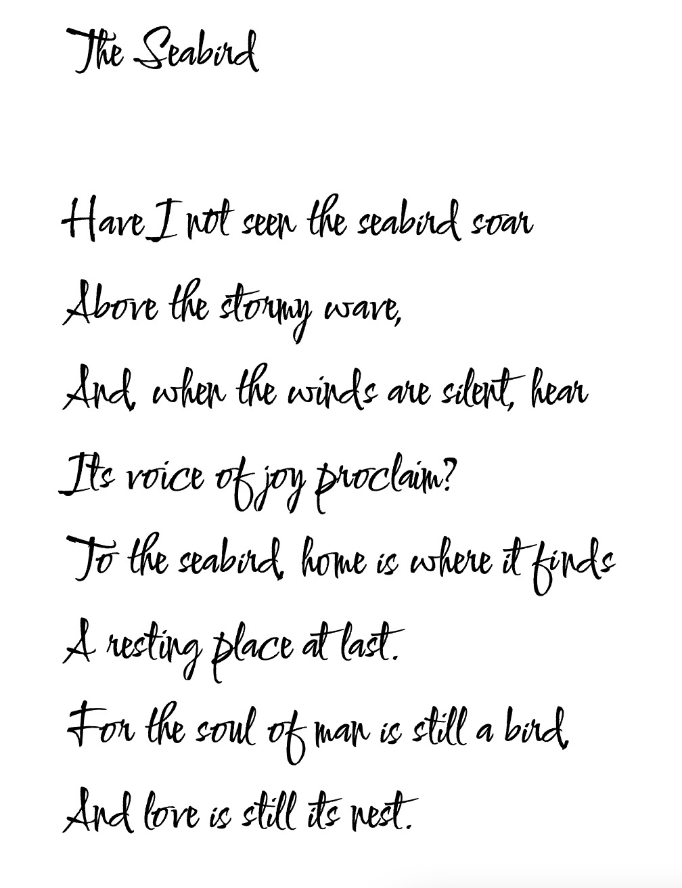

# The Seabird – Henry David Thoreau

Have I not seen the sea-bird soar   
Above the stormy wave,   
And, when the winds are silent, hear   
Its voice of joy proclaim?   
To the sea-bird, home is where it finds   
A resting-place at last.   
For the soul of man is still a bird,   
And love is still its nest.
