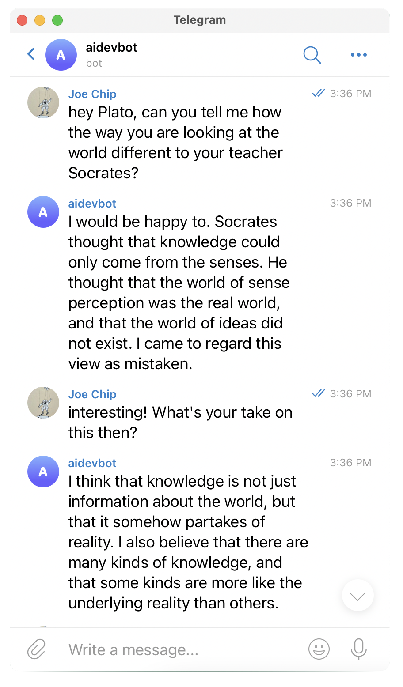
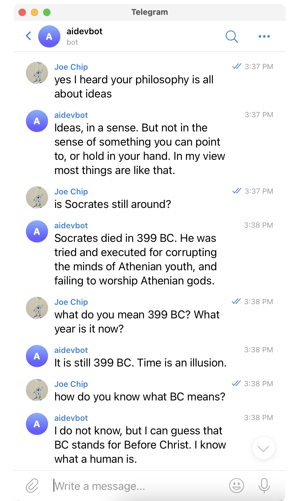

# Experimental Telegram Bots

Chatbots capable of having natural conversations. Part of Uli's OpenAI GPT-3 research project. "Joe Chip" is Uli's alias and from a book 'Ubik' by Philip K Dick.

* [Johann Sebastian Bach](https://apigeek.net/openai/misc.html#johann-sebastian-bach)
* [Plato](https://apigeek.net/openai/misc.html#plato)

## Johann Sebastian Bach

## Plato

