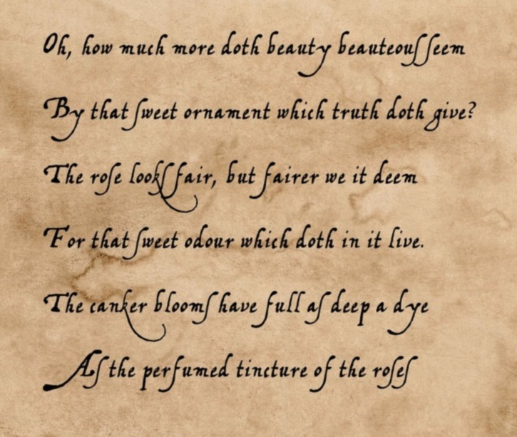

# A Shakespeare Sonnet

Oh, how much more doth beauty beauteous seem   
By that sweet ornament which truth doth give?   
The rose looks fair, but fairer we it deem   
For that sweet odour which doth in it live.   
The canker blooms have full as deep a dye   
As the perfumed tincture of the roses

Hang on such thorns, and play as wantonly   
When summer's breath their masked buds discloses   
But, for their virtue only is their show,   
They live unwooed, and unrespected fade,   
Die to themselves. Sweet roses do not so;   
The unwooed blush not, but, unpruned, bear

Their fruit, and are, to them, their own love's spies,   
Which, to their sweet selves, in their sweet leaves,   
All, in their colours, painted, are, to show   
How sweet and fair they are: yet, in their show,   
Who looks, may see their pilfered sweets; which steal,   
And in their colours, their own hearts' shadows see;

For, to themselves, they do their bosoms bleed.
