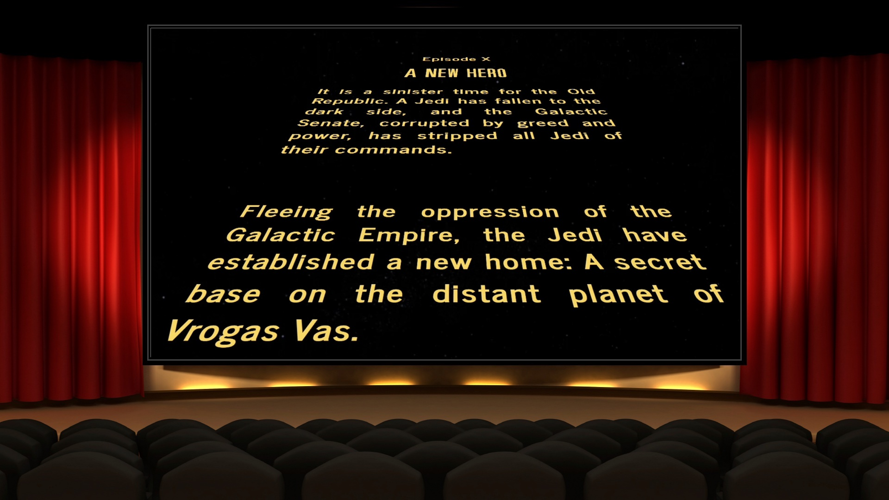

# Star Wars: Episode X

## Potential Titles for this film:

A New Beginning   
The Blood of the Empire   
A New Empire   
A New Hope for Disney   
A New Dawn   
The Droids of the Rebellion   
The Droid Who Loved Me   
The Last Droids   
The Droids Awake   
The Three Droids   
The Droid Maker   
The Father of the Empire   
The Father of the Force   
Leia's Night Out With The Droids   
The Lost Skywalker
A New Hero

## Opening Crawl for "A New Hero":

[Video](https://www.youtube.com/watch?v=Phy9rb76sjk)

It is a sinister time for the Old Republic. A Jedi has fallen to the dark side, and the Galactic Senate, corrupted by greed and power, has stripped all Jedi of their commands.

Fleeing the oppression of the Galactic Empire, the Jedi have established a new home: A secret base on the distant planet of Vrogas Vas.

Away from the public eye, the Jedi Order has begun training a new Jedi, a young man determined to restore the Jedi to their full strength.

But the Galactic Empire has ordered the extermination of the Jedi, and the Jedi's new home is not as safe as it seems. When the Empire discovers the location of the Jedi base, the young Jedi and his friends must make a choice: flee or fight.

## Movie Titles for Episodes I - IX

Episode 1: The Phantom Menace   
Episode 2: Attack of the Clones   
Episode 3: Revenge of the Sith   
Episode 4: A New Hope   
Episode 5: Empire Strikes Back   
Episode 6: Return of the Jedi   
Episode 7: The Force Awakens   
Episode 8: The Last Jedi   
Episode 9: The Rise of Skywalker   