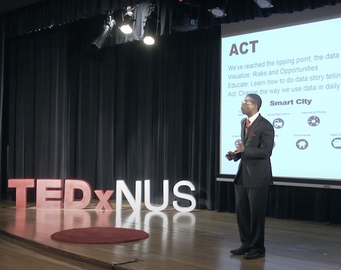

# Transcribing and Summarizing a TedX Talk

### AI Tasks:

* Listen to this TedX talk: [https://www.youtube.com/watch?v=bS1Q9N9CyRI](https://www.youtube.com/watch?v=bS1Q9N9CyRI)
* Transcribe it to text --> [tedx-acti1.txt](tedx-acti1.txt)
* Reformat the text --> [tedx-acti2.md](tedx-acti2.md)
* Summarize the essence of the talk

### Summary – One Paragraph

 The speaker talks about how actionable intelligence can help us make better decisions, and how we can use data to improve our lives. He gives examples of how data can be used to improve safety, efficiency, and communication. He urges the audience to think differently about how they use data, and to use it to make a difference in the world.
 
### Detailed Summary

 In his talk, Keith explores what it means to have actionable intelligence, and how this can be used to make better decisions in both personal and professional life. He explains that actionable intelligence is about having the right information in the right person's hands in time, in order to improve outcomes.

Keith begins by discussing the 2016 US Presidential Election, and how everyone was surprised by the result. He attributes this to the fact that there was not enough data available to make an informed decision. He argues that we need to learn from this and use data more effectively in order to make better decisions.

He then shares his personal story of how he was able to use data to improve his mother's care after she had a stroke. He explains that he was able to get more information and make better decisions thanks to the data that was available.

Keith goes on to discuss how data can be used in a number of different ways, including to improve safety, to understand customer behavior, and to make better decisions about employees. He explains that data is available to us, but we need to learn how to use it effectively in order to make the most of it.

The speaker ends his talk by urging the audience to think about how they can use data to make a difference in the world. He explains that there is an opportunity for everyone to use data to make a positive impact, and that we need to be proactive in order to make the most of it.