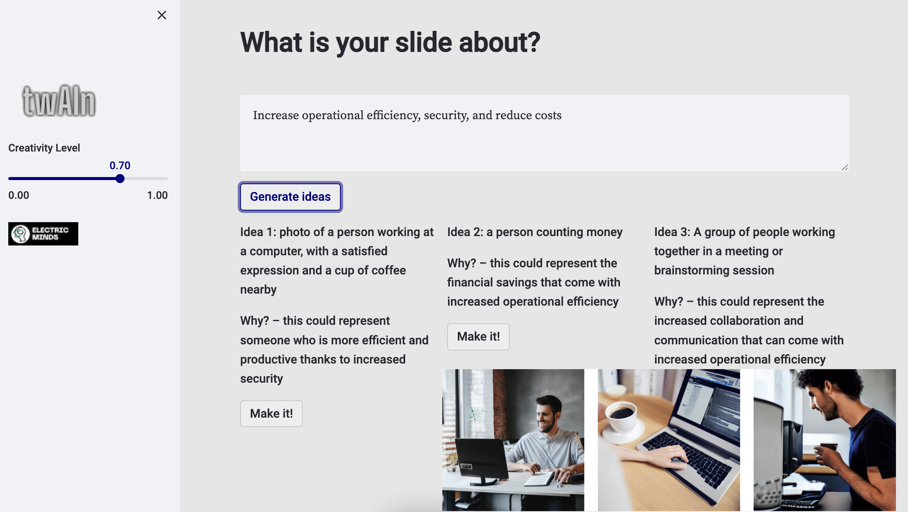

# Create Visuals for Slides

Need a photo or visual that you can use to make your Powerpoint slide more effective by illustrating the key points?

This prototype can:

* get a sense of what you're trying to say in your slide
* suggest a couple of ideas for photos or illustrations that support your key points
* generate images (not Google search!) for the idea you like best!

### Input:

"Increase operational efficiency, security, and reduce costs"

### Generated ideas:

#### 1:
- details: A photo of a person working at a computer, with a satisfied expression and a cup of coffee nearby.
- explanation: this could represent someone who is more efficient and productive thanks to increased security.

#### 2:
- details: a person counting money
- explanation: this could represent the financial savings that come with increased operational efficiency.

#### 3:
- details: A group of people working together in a meeting or brainstorming session
- explanation: this could represent the increased collaboration and communication that can come with increased operational efficiency.

